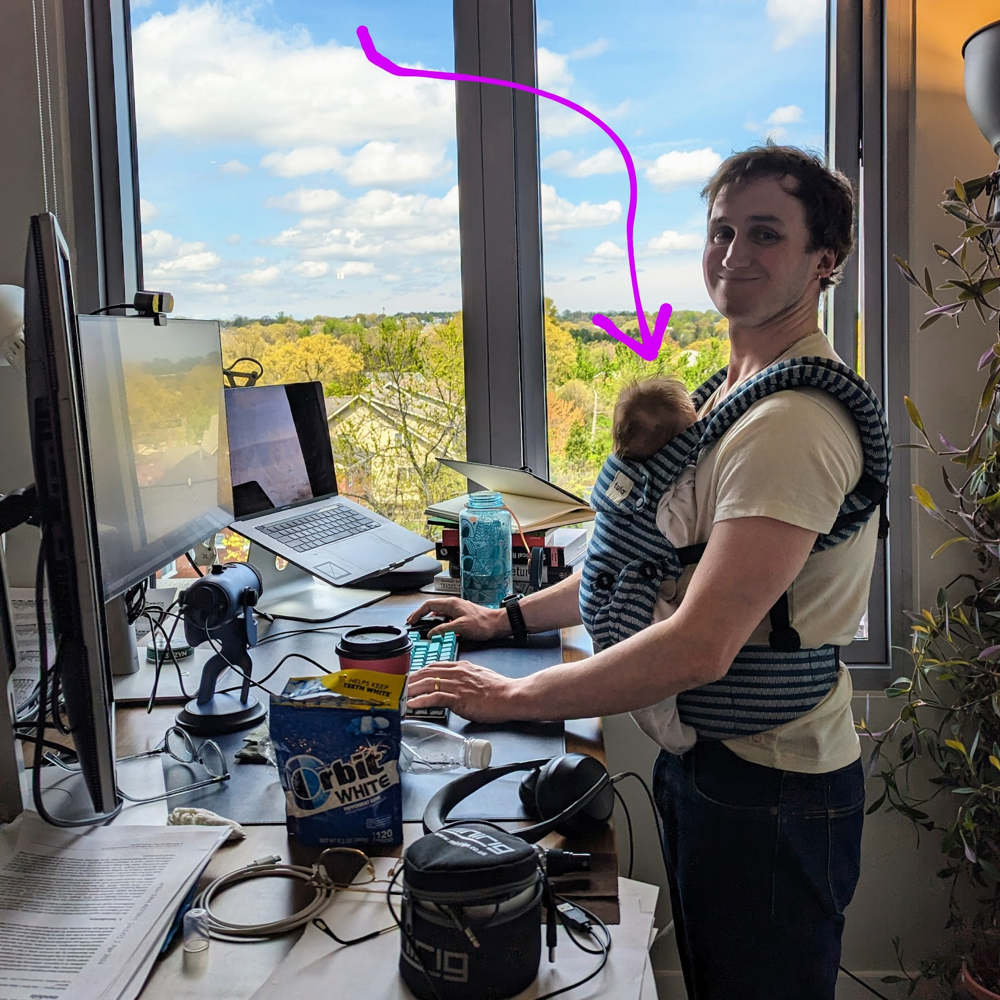

# mats-application-2024
My submission to the Nanda stream of the 2024 MATS program - ten hours of work on a concrete subproblem within mechanistic interpretability.

Google doc explaining the results is [here](https://docs.google.com/document/d/1dO5fxHJrbFJ_qdgbsHTn5iGNxtWF7hi7COQZuYv6LfQ/edit?usp=sharing).

Colab link is [here](https://colab.research.google.com/github/wllgrnt/mats-application-2024/blob/main/sae_explorer.ipynb).

Complication to the time requirement is here:

## Addendum - a guide to setting up a Windows dev env in a hurry

POV: you have realised that your ancient desktop with a fancy new 4070 SUPER no longer has a functional Linux install, but the deadline for the MATS application is in 2 days.

1. Install VSCode. 
2. Install WSL.
3. Realise that you don't have virtualization enabled in your BIOS - go to 'Advanced Frequency -> Enable SVM', since its AMD.
4. Install Windows Terminal, boot Ubuntu (`wsl`).
5. Generate new SSH keys, add to Github.
6. git clone your new repo from your WSL terminal, use `code .` to open the repo in WSL/VSCode.
7. From then on, use the integrated terminal. Use `eval "$(ssh-agent -s)"` then `ssh-add` to ensure you can push commits.
8. Install zsh/oh-my-zsh (useful for gco, gst aliases).
9. Install conda, create an mechinterp env. (`conda create -n mechinterp python=3.11 numpy scipy matplotlib scikit-learn`)
10. Install the Jupyter and Python extensions for VSCode.
11. Activate your conda env, install Jupyter.
12. Worry about CUDA later.
